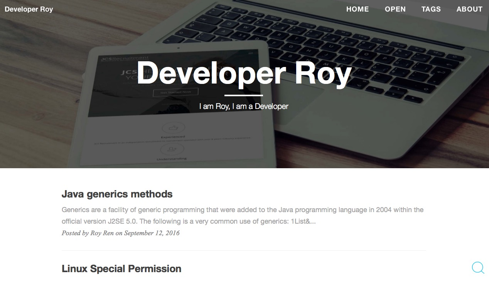

# RoyRenBlog

[Developerroy.com](http://Developerroy.com) template

### How to install:

1. Install jeykll

	gem install jekyll
	
	gem install jekyll-paginate

2. Copy RoyRenBlog into your server (Please google if you would like to deploy to github.io).
3. Run either of the following commands to start your website。
    
        jekyll serve --watch &
        jekyll serve --watch --incremental & //incremental update, sugest not using this if you often need to change your Configurations.

Option (for better build your website, the following script may help):

    #!/bin/bash
    
    ps aux |grep jekyll |awk '{print $2}' | xargs kill -9
    cd /path/to/blog
    jekyll serve --watch &
    
    
> The command started with "ps" is killing the jekyll process
>
> cd to the root directory of your website
>
> Start jekyll server

## Configurations:
1. Modify _config.yml(Global info，please note that it's important to change "disqus_id" to yours，otherwise you will not see any comments)。
2. Modify about/index.html.
3. Modify _include/nav.html.
4. Modify _includes/footer.html

### Updates:
#### 2016-06-12
1. Modified the tags display issue after jekyll version update to 3.1.0+
2. Used CDN (jquery, bootstrap etc) and improving the bandwidth efficiency

#### 2015-12-20
1. The disqus_id has been moved to _config.xml，easy manage。

#### 2015-12-09:

1. Updated _config.yml to be better compatible with comjekyll 3.0+ version。
2. Removed anchor, and no any `#` in front of the title. 

#### 2015-10-10:

1. Added article search function which can be triggered by double typing ctrl in PC.
